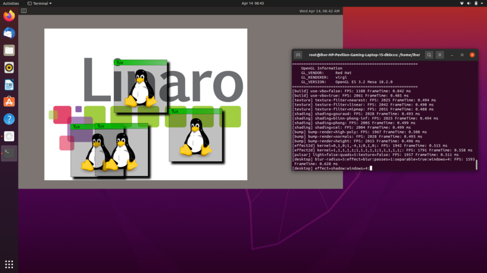

# Remote Virtio GPU Device (RVGPU)

**RVGPU is a client-server based rendering engine, which allows to render 3D on one device (client) and display it via network on another device (server)**

 

## Contents
* [Repository structure](#repository-structure)
* [Build instructions](#build-instructions)
* [HowTo run RVGPU locally](#how-to-run-rvgpu-locally)
* [HowTo run RVGPU remotely](#how-to-run-rvgpu-remotely)
* [Licensing](#licensing)


## Repository structure

```
.
├── meta-rvgpu                     # yocto meta layer
├── documentation                  # rvgpu architecture documents
├── include
│    ├── librvgpu                  # librvgpu header files
│    ├── rvgpu-generic             # common header files for all components
│    ├── rvgpu-proxy               # rvgpu-proxy header files
│    ├── rvgpu-renderer            # rvgpu-renderer header files
├── src
│    ├── librvgpu                  # librvgpu source files
│    ├── rvgpu-driver-linux        # rvgpu driver source files
│    ├── rvgpu-proxy               # rvgpu-proxy source files
│    ├── rvgpu-renderer            # rvgpu-renderer source files
│    ├── rvgpu-sanity              # sanity module source files.
```


## Build instructions
Currently RVGPU is only supported and tested on Ubuntu 20.04 LTS AMD64.

However you can try it with different Linux distros with Wayland display server.

Assuming, you have a clean Ubuntu 20.04 installed, please perform the following steps:

* Install build tools
```
sudo apt install gcc g++ make cmake
```
* Install libpgm to be able to build ZeroMQ with PGM/ePGM support
```
sudo apt install libpgm-5.2-0 libpgm-dev
```
* Install ZeroMQ with PGM/ePGM support
```
wget https://github.com/zeromq/libzmq/releases/download/v4.3.4/zeromq-4.3.4.tar.gz
tar -xf zeromq-4.3.4.tar.gz
cd ~/zeromq-4.3.4/
./configure --with-pgm
make
sudo make install
```
* Install virglrenderer
```
sudo apt install libvirglrenderer1 libvirglrenderer-dev
```
* Install Weston compositor
```
sudo apt install libjpeg-dev libwebp-dev libsystemd-dev libpam-dev libva-dev freerdp2-dev \
                 libxcb-composite0-dev liblcms2-dev libcolord-dev libgstreamer1.0-dev libgstreamer-plugins-base1.0-dev libpipewire-0.2-dev \
                 libxml2-dev meson libxkbcommon-x11-dev libpixman-1-dev libinput-dev libdrm-dev wayland-protocols libcairo2-dev \
                 libpango1.0-dev libdbus-1-dev libgbm-dev libxcursor-dev

wget https://github.com/wayland-project/weston/archive/8.0.93.tar.gz
tar -xf 8.0.93.tar.gz
cd ~/weston-8.0.93/
meson build/
ninja -C build/ install
```

* Install remote-virtio-gpu
```
cd ~/remote-virtio-gpu
mkdir build
cmake -B build -DCMAKE_BUILD_TYPE=Release -DVIRTIO_LO_DIR=../rvgpu-driver-linux
make -C build
sudo make install -C build
```

* Install mesa 18.2.0 with virgl support to a separate /usr/lib/mesa-virtio folder
```
sudo apt install llvm libwayland-egl-backend-dev libxcb-glx0-dev libx11-xcb-dev libxcb-dri2-0-dev libxcb-dri3-dev \
                 libxcb-present-dev libxshmfence-dev libgbm-dev \
                 libsdl2-dev libgtk-3-dev libgles2-mesa-dev libpixman-1-dev \
                 libtool autoconf libdrm-dev python libinput-dev libwayland-egl-backend-dev glmark2-es2-wayland

wget https://archive.mesa3d.org//mesa-18.2.0.tar.xz
tar -xf mesa-18.2.0.tar.xz
cd ~/mesa-18.2.0/
patch -p1 < ../remote-virtio-gpu/meta-rvgpu/recipes-graphics/mesa-virtio/files/0001-glBufferData-Update-resource-backing-memory.patch
./configure --prefix=/usr/lib/mesa-virtio --exec_prefix=/usr/lib/mesa-virtio --libdir=/usr/lib/mesa-virtio \
            --includedir=/usr/include/mesa-virtio --sysconfdir=/etc/mesa-virtio --datadir=/usr/share/mesa-virtio \
            --with-dri-drivers=swrast --with-gallium-drivers=swrast,virgl --enable-dri3=yes --with-platforms=drm,wayland,x11 --disable-glx
make
sudo make install
```

## How to run RVGPU locally
**rvgpu-renderer** creates a Wayland backend to display the stream, rendered by **rvgpu-proxy**.

Therefore on login screen, please choose [Wayland](https://linuxconfig.org/how-to-enable-disable-wayland-on-ubuntu-20-04-desktop).

Run both RVGPU client (**rvgpu-proxy**) and server (**rvgpu-renderer**) on the same machine via the localhost interface:

Launch rvgpu-renderer from user, you are currently logged in:
```
rvgpu-renderer -b 1280x720@0,0 -p 55667 &
```

Open another terminal and switch to **root** user:
```
sudo su
modprobe virtio-gpu
modprobe virtio_lo

mkdir -p /run/user/0
export XDG_RUNTIME_DIR=/run/user/0
rvgpu-proxy -l 0 -s 1280x720@0,0 -n 127.0.0.1 &

export LD_LIBRARY_PATH=/usr/lib/mesa-virtio
weston --backend drm-backend.so --tty=2 --seat=seat_virtual -i 0 &
```

After that **rvgpu-renderer** will display *weston* rendered and transferred via localhost by **rvgpu-proxy**.

Now you can launch glmark2-es2-wayland or some other graphical application to verify, that everything works.

> To support the VSYNC feature in rvgpu-proxy,
apply and rebuild the Linux kernel with the following path
~/remote-virtio-gpu/meta-rvgpu/recipes-kernel/linux/linux-renesas/0001-drm-virtio-Add-VSYNC-support-linux-5-8.patch


## How to run RVGPU remotely

The way is almost the same, as to run **RVGPU** locally.

Pass appropriate server IP address to **rvgpu-proxy**.

Launch **rvgpu-renderer** on one machine and **rvgpu-proxy** with the kernel modules on the another one.

**Note**: Some graphical applications generate much network traffic.

Configure the network to 1Gbps speed.

## Build RVGPU for the RCAR H3 board

Refer to the ~/remote-virtio-gpu/meta-rvgpu/README.md instruction.

## Licensing

All the source code is under the [Apache license](https://www.apache.org/licenses/LICENSE-2.0.html) and  published with a following Panasonic copyright:
```
Copyright (c) 2021  Panasonic Corporation.

Licensed under the Apache License, Version 2.0 (the "License");
you may not use this file except in compliance with the License.
You may obtain a copy of the License at

     http://www.apache.org/licenses/LICENSE-2.0

Unless required by applicable law or agreed to in writing, software
distributed under the License is distributed on an "AS IS" BASIS,
WITHOUT WARRANTIES OR CONDITIONS OF ANY KIND, either express or implied.
See the License for the specific language governing permissions and
limitations under the License.
```
